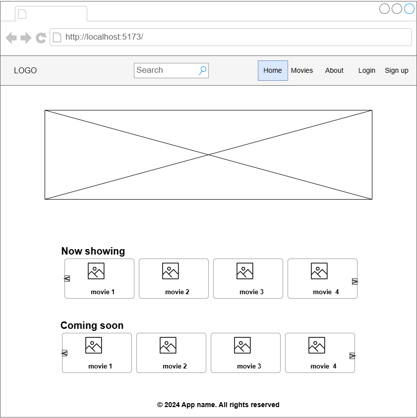
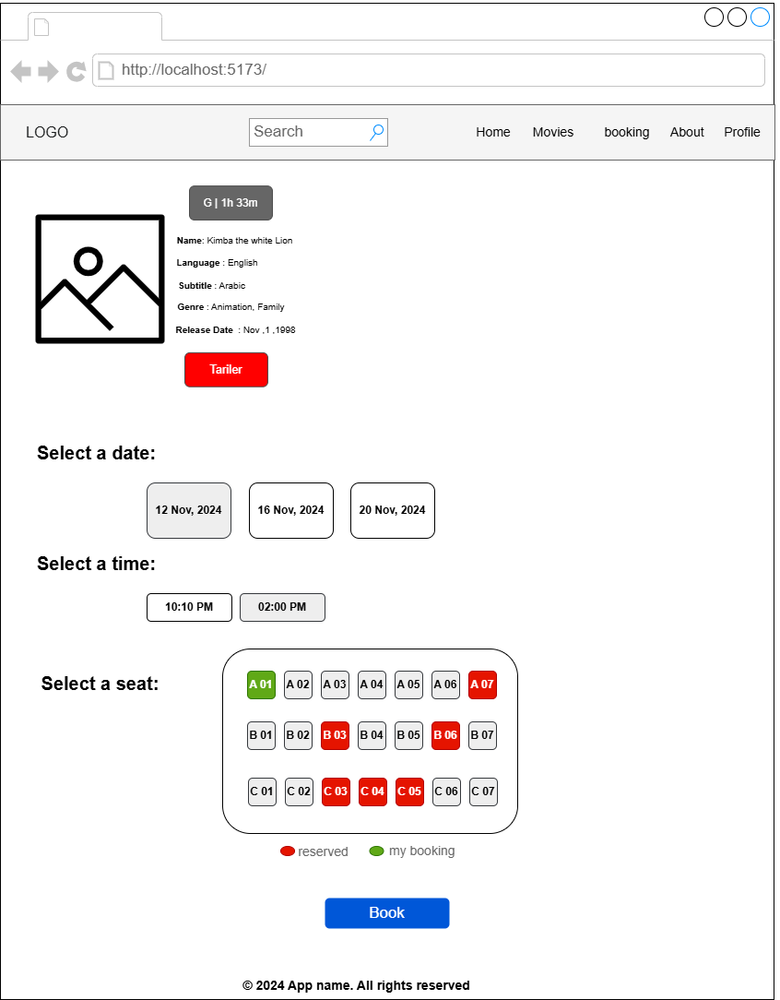
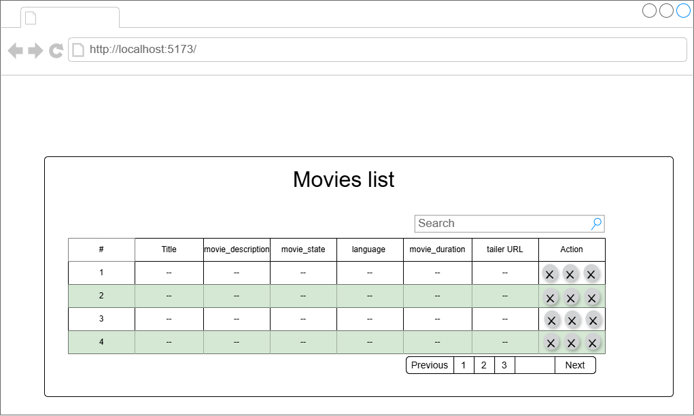
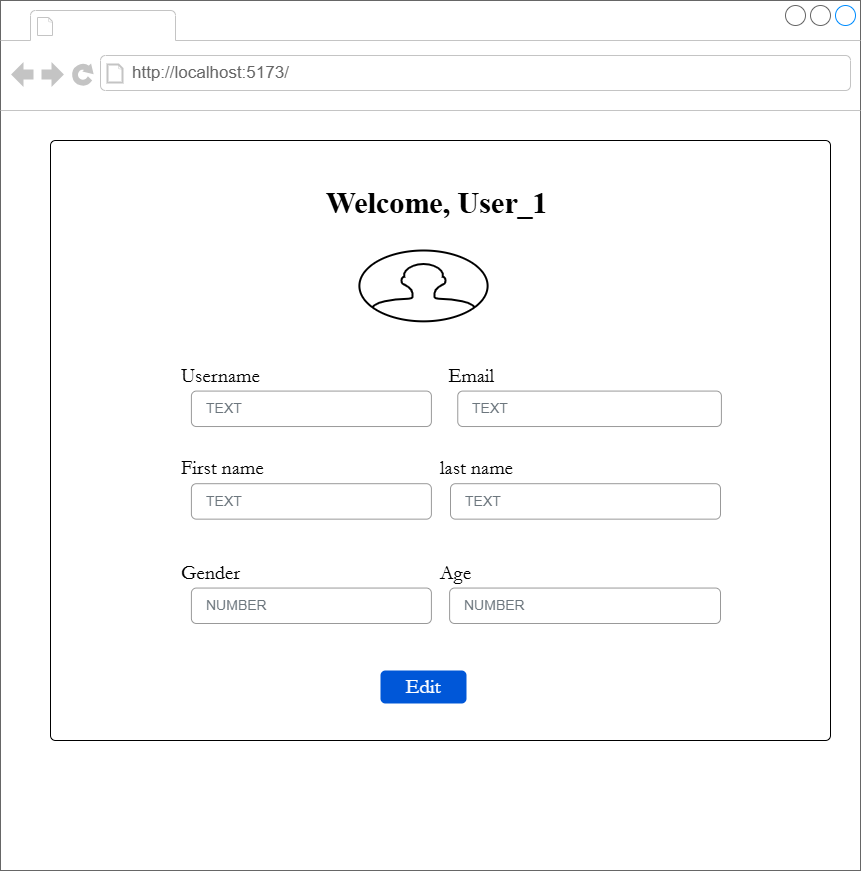
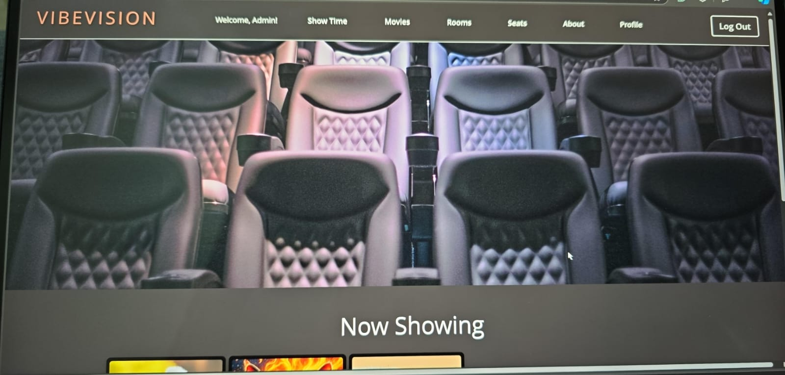
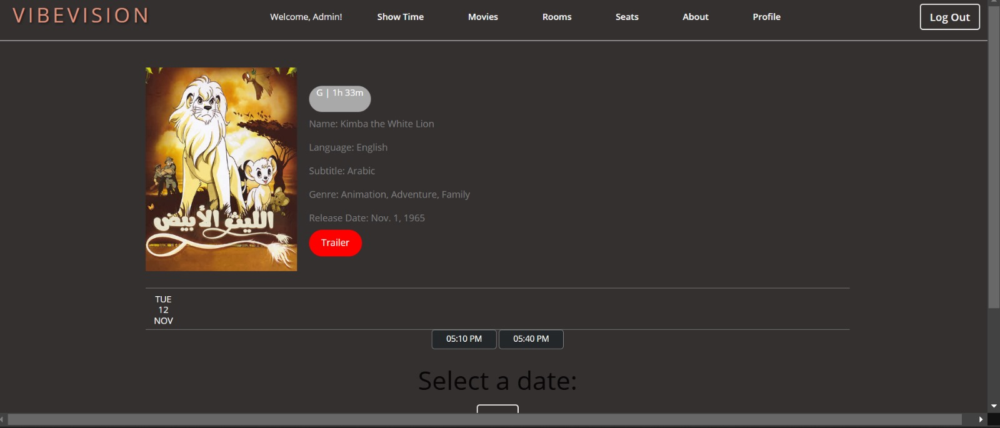
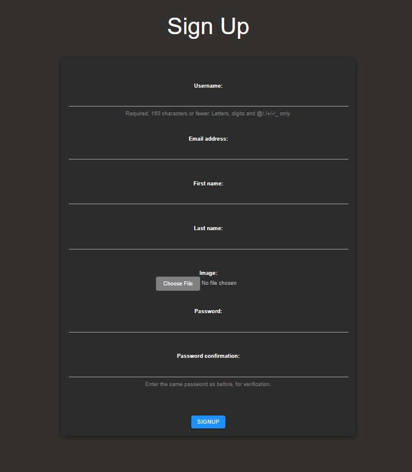
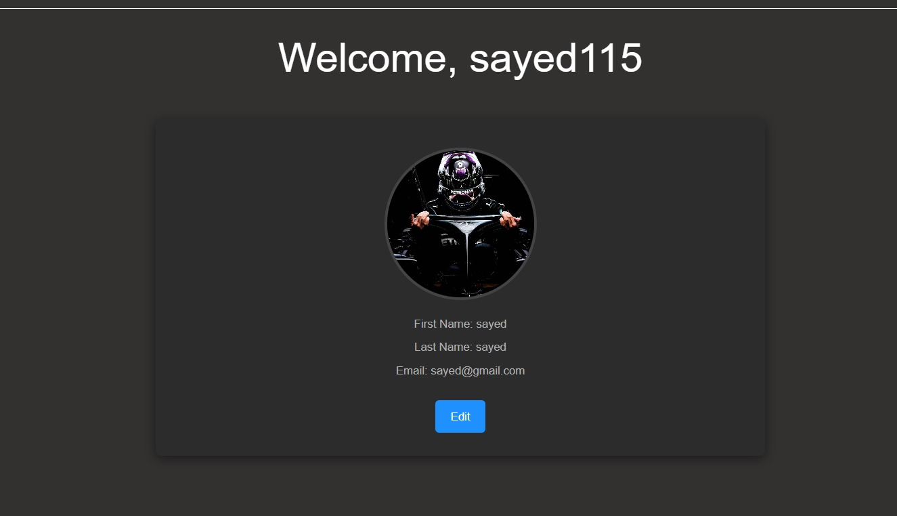

# Vibe Vision 
## Date: 14/11/2024
## By: Mujtaba Jameel || Hussain Aliwi || Mohammed Yaqoob  || Sayed Mohammed 
####  [GitHub](https://github.com/Mujtaba18/VibeVision) 

***
### ***_Description_***
#### **VibeVision app provides a unique cinematic experience where users can book their favorite movies, receive personalized recommendations, and filter options among various films. They can reserve specific seats in designated cinema rooms, ensuring a customized and enjoyable viewing experience.** 

***

### ***_Technologies Used_***
* Python
* django
* PostgreSQL 
* JavaScript 
* HTML
* CSS 
* DataTables
* Materialize
***

### ***Application users***
* User
* Admin

***

### ***Entity Relationship Diagram (ERD)***
<!-- ##### Sign up and sign in as a new user and then begin viewing the different sections of the website.
##### A Trello board was used to keep track of development progress and can be viewed [here](https://getnave.com/blog/trello-kanban-boards).
##### The project was deployed and can be viewed [here](https://www.namecheap.com/market). -->

***

***
### ***Wireframes***

***

***

### ***Main Screenshots***

***

***

***

***

***

### ***_Future Updates_***
- [ ] User cinema reviews
- [ ] Payment method
  
***
### ***_Credits_***
##### Images: [GeeksforGeeks](https://pixabay.com/)
##### Markdown Guide: [MDN](https://developer.mozilla.org/en-US/docs/Web/JavaScript)
##### DataTable: [DataTable](https://datatables.net/)

***
